# getmynixos
My own configure files for NixOS. With it you can rebuild my full environment on any computer with NixOS.

This project is specified for NixOS on WSL, not a NixOS running on a server or a desktop PC, or other Linux distro / Unix-like system / Windows native POSIX layer with a Nix package manager.

## Build
On the NixOS system, you'll have to initialize `/etc/nix/` as a Git repository to contain the config files.

```bash
# Set the binary cache repository temporarily
sudo nixos-rebuild switch --option substituters "https://nix-community.cachix.org" --option trusted-public-keys "nix-community.cachix.org-1:mB9FSh9qf2dCimDSUo8Zy7bkq5CX+/rkCWyvRCYg3Fs="
# Install Git temporarily
nix-shell -p git
# Initialize `/etc/nix/` as a repository
cd /etc/nixos
sudo git init . -b main
sudo git add .
# Add the GitHub repository as remote and fetch the files
sudo git remote add origin https://github.com/HeavySnowJakarta/getmynixos
git pull origin
# Apply the configuration files
sudo nixos-rebuild switch
```

## File Structure

```
.
├config             # Global configurations, like urls and keys of binary cache repositories.
├hosts              # Real `configuration.nix` for each cases this project used for.
├interface
├homes              # Not enabled yet. Works with home manager.
├bootstrap          # Not related to the main part. Not for daily systems.
├apps               # Not enabled yet.
|
├configuration.nix  # Calls `flake` and install most-needed packages.
├flake.nix          # Entrance of `flake`, only calls `interface`s.
├options.nix        # Defines what this project is used for.
└...
```



```mermaid
%% This graph describes the releastionship among the parts of this project.
flowchart LR
    subgraph layer1[1]
        configure[./configure.nix]
        flake[./flake.nix]
    end

    subgraph layer2[2]
        Ihost[./interface/host.nix]
        Ihome[./interface/home.nix]
    end

    subgraph Options
        options[./options.nix]
    end

    subgraph layer3[3]
        host[./hosts/*/default.nix]
    end

    subgraph layer4[4]
        specific_configuration[./hosts/*/configuration.nix]
    end

    subgraph layer5[5]
        users[./hosts/*/users.nix]
        services[./hosts/*/services.nix]
    end

    subgraph layer6[6]
        apps[./apps/*]
    end

    configure --> flake
    flake --> Ihost
    options --> Ihost
    options -.-> Ihome
    Ihost ---> host

    host --> specific_configuration

    specific_configuration --> users
    specific_configuration --> services

    users -.-> apps
    services -.-> apps

    classDef default fill:#ecf0f1,stroke:#34495e,color:#34495e

    classDef non_enabled color:#95a5a6,stroke:#95a5a6
    class Ihome,apps non_enabled
    classDef filled color:#ecf0f1
    class layer1,layer2,layer3,layer4,layer5,Options filled
 
    classDef Layer1 fill:#2ecc71
    class layer1 Layer1
    classDef Layer2 fill:#e74c3c
    class layer2 Layer2
    classDef Layer3 fill:#f1c40f
    class layer3 Layer3
    classDef Layer4 fill:#34495e
    class layer4 Layer4
    classDef Layer5 fill:#9b59b6
    class layer5 Layer5
    classDef Options fill:#3498db
    class Options Options
```

Notes:

+ `1`: entrance layer
+ `2`: interface layer
+ `3`: host layer
+ `4`: configuration layer
+ `5`: sub-configuration layer
+ `6`: app configuration layer
+ The dotted lines and grey nodes mean they are not actually used yet.

The specific functions of the directories:

### `config`

While `./options.nix` stores the most basic configurations of the project, `./config/*.nix` stores the more specific options, like whether to use a mirror repository, and which experimental features of Nix to enable.

### `hosts`

`./hosts/*/default.nix` defines the specific `flake` hosts. The _real_ `configuration.nix` for each host locales on `./hosts/*/configuration.nix`, and the user settings as well as services lie on `./hosts/*/services.nix` and `./hosts/*/users.nix`

### `interface`

`./flake.nix` and home manager only call `./interface/*.nix`. They send the types (like `server`, `desktop` or `wsl`) stored at `./options.nix` to `./interface/*.nix`, and then `./interface/*.nix` decides which profile of `./hosts/*/` or `./homes/*` to use according to the options.